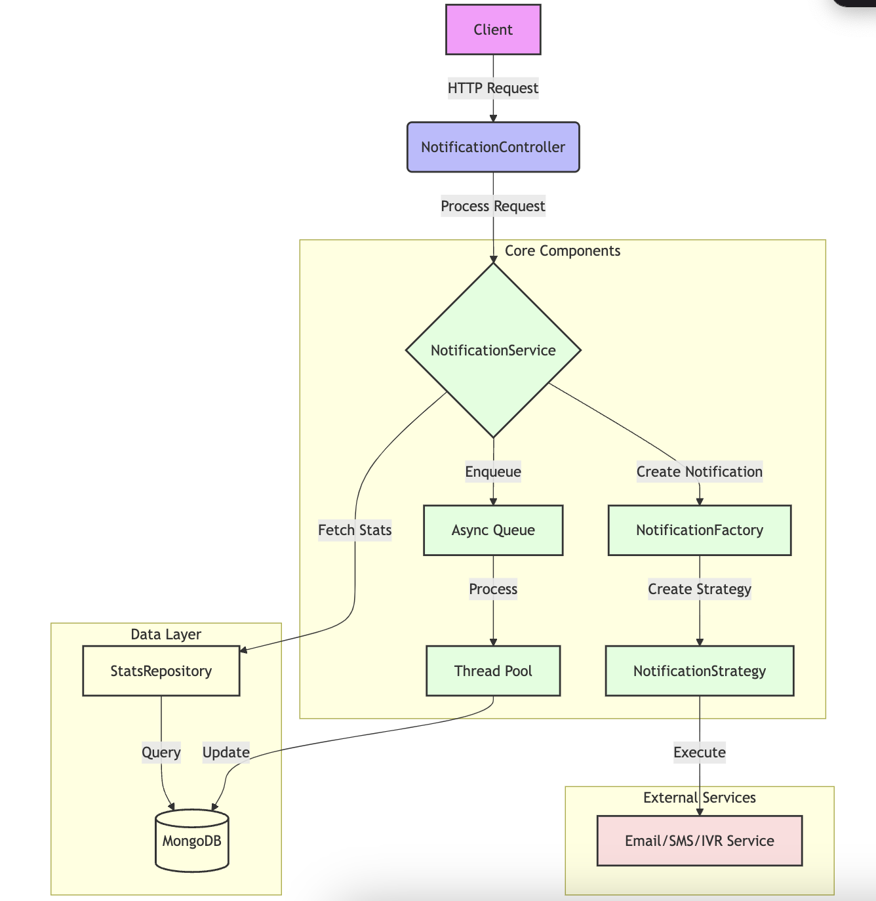

# Notification Service

## Overview

This project is a Spring Boot application designed to manage and send notifications. It provides a scalable and flexible solution for handling various types of notifications (Email, SMS, IVR) and retrieving notification statistics.

## Implementation Overview

As per the Assignment, the following requirements have been implemented:

1. Spring Boot Application
    - The project is built using Spring Boot.

2. Send Notification Endpoint (/send)
    - Supports multiple notification types: Email, SMS, IVR
    - Implements empty functions for each type, simulating third-party API triggers
    - Handles batch notification requests

3. Get Notification Stats Endpoint (/stats)
    - Accepts date range as input
    - Returns daily notification stats including:
        - Date
        - Notification type
        - Status
        - Count

4. Database Schema
    - Uses MongoDB for data storage
    - Two main collections:
        - `notifications`: Stores individual notification records
        - `daily_stats`: Stores aggregated daily statistics

5. Design Patterns
    - Strategy Pattern: For different notification types
    - Factory Pattern: For creating notification strategy objects
    - Repository Pattern: For data access abstraction

6. Asynchronous Processing
    - Implemented a queue-based system for processing notifications
      - For this assignment, a concurrent queue (ConcurrentLinkedQueue) is used to demonstrate the concept of asynchronous processing 
      - Note: In a production-grade application, a distributed message queue system like Apache Kafka would be more suitable due to its scalability, fault-tolerance, and ability to handle high throughput
    - Used a thread pool for parallel processing

## High-Level Design Diagram


## Implementation Details

### Technology Stack
- Java
- Spring Boot
- MongoDB
- Gradle

### Key Components
1. `NotificationController`: Handles REST endpoints
2. `NotificationService`: Core business logic
3. `StatsRepositoryImpl`: Custom implementation for stats retrieval and updates
4. `NotificationStrategy`: Interface for notification strategies
5. `NotificationFactory`: Factory for creating strategy objects

### Database Schema

#### notifications Collection
```
{
  id: String,
  userId: String,
  type: Enum<NotificationType>,
  content: String,
  status: Enum<NotificationStatus>,
  timestamp: DateTime
}
```

#### daily_stats Collection
```
{
  id: String,
  date: Date,
  type: Enum<NotificationType>,
  status: Enum<NotificationStatus>,
  count: Integer
}
```

### API Endpoints

1. Send Notifications
    - `POST /api/v1/notifications/send`
    - Accepts a list of notification requests

2. Get Statistics
    - `GET /api/v1/notifications/stats`
    - Parameters:
        - startDate: LocalDate
        - endDate: LocalDate
        - type: NotificationType (optional)
        - status: NotificationStatus (optional)


## Assumptions

- The system is designed to handle high volumes of notifications
- User IDs are assumed to be valid and existing when sending notifications
- The system operates in a single time zone (based on use of LocalDate and LocalDateTime)
- There is no rate limiting or throttling implemented for notification sending
- Notification failures are logged but not automatically retried
- Daily stats are updated in real-time as notifications are processed


## Scaling the System for High Traffic

1. Horizontal Scaling: Use load balancers to distribute traffic across multiple application instances.
2. Database Optimization: Implement MongoDB sharding and replica sets for better performance and data distribution.
3. Message Queue: Replace in-memory queue with Apache Kafka for improved scalability and fault-tolerance.
4. Caching: Introduce Redis to reduce database load and improve response times.
5. Containerization: Use Docker and Kubernetes for efficient service management and scaling.


## Future Improvements: Kafka for Message Queue

Upgrade the queueing system:
- Replace the in-memory concurrent queue with Apache Kafka
- This would provide better scalability, fault-tolerance, and the ability to handle much higher volumes of notifications in a production environment


## Future Improvements: Retry mechanism

- Implement more comprehensive error handling and retry mechanism

## Future Improvement: User Management

While not part of the original requirements, a future enhancement could include 
user management with a MySQL database. Here's a simple table design that could be used:

```sql
CREATE TABLE users (
    id INT AUTO_INCREMENT PRIMARY KEY,
    username VARCHAR(50) NOT NULL UNIQUE,
    email VARCHAR(100) NOT NULL UNIQUE,
    phone_number VARCHAR(20),
    preferred_notification_type ENUM('EMAIL', 'SMS', 'IVR') DEFAULT 'EMAIL',
    created_at TIMESTAMP DEFAULT CURRENT_TIMESTAMP,
    updated_at TIMESTAMP DEFAULT CURRENT_TIMESTAMP ON UPDATE CURRENT_TIMESTAMP
);
```

This table would allow for:
- User identification and contact information storage
- Preferred notification method selection

Why a MySQL database for user management?
1. ACID Compliance: MySQL ensures data integrity through ACID properties, crucial for user data.
2. Consistency: Immediate consistency is important for user data, which MySQL provides out of the box.
3. Data Relationships: Managing relationships between data, like user roles and permissions.

This enhancement would significantly improve the personalization and effectiveness of the notification service.


## Setup and Running

Follow these steps to set up and run the Notification Service:

1. **MongoDB Setup**
   - Pull the MongoDB Docker image:
     ```
     docker pull mongo
     ```
   - Run MongoDB container:
     ```
     docker run -d -p 27017:27017 --name notification-mongo mongo
     ```

2. **Project Configuration**
   - Ensure `application.properties` file contains the MongoDB configuration

3. **Build and Run the Application**
   - Navigate to the project root directory
   - Run the following command to build the project:
     ```
     ./gradlew build
     ```
   - Start the application using:
     ```
     ./gradlew bootRun
     ```

4. **Access the API**
   - The API will be available at: `http://localhost:8080`
   - Swagger UI documentation can be accessed at: `http://localhost:8080/swagger-ui/index.html#/`
   - Use the Swagger UI or any API client (like Postman) to test the endpoints


